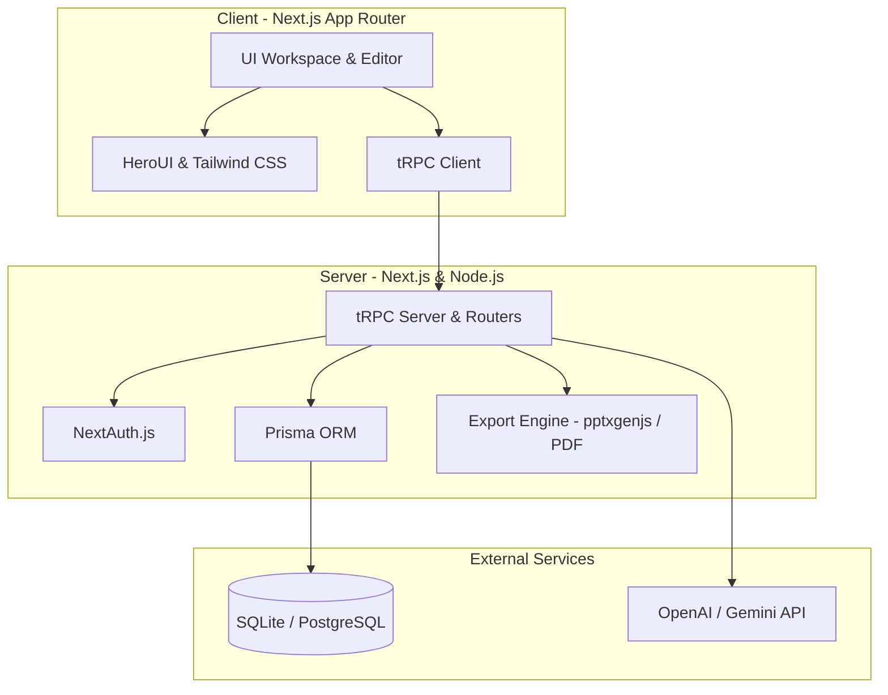
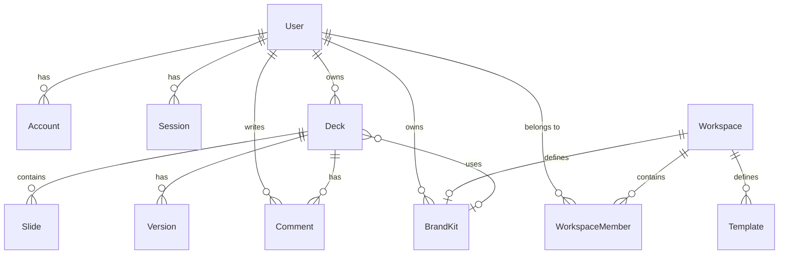

# GenStack AI — System Design Specification

This document details the system design, database schema, API architecture, and AI orchestration pipelines for **GenStack AI**, a production-grade AI-powered presentation workspace that transforms text prompts, notes, PDFs, or URLs into professional, export-ready slide decks.

---

## 1. High-Level Architecture

GenStack AI uses a decoupled, type-safe stack optimized for fast rendering, rich interactive editing, and reliable asynchronous generation:



---

## 2. Core Database Schema

The SQLite/PostgreSQL schema is managed via Prisma. Relationships enforce cascade deletes where applicable to ensure data hygiene.



### 2.1 Database Models (Prisma Reference)

*   **User & Authentication**: Integrated with NextAuth adapter rules (`User`, `Account`, `Session`, `VerificationToken`).
*   **Workspace**: Groups members and enforces access control lists.
*   **Deck**: Represents a presentation. Linked to slides, version snapshots, and brand kits.
*   **Slide**: Individual slides. Content is serialized as JSON for layout flexibility. Enforces spatial order and lock states.
*   **BrandKit**: Color tokens (primary, secondary, accent, background, text) and typography styles applied to decks.
*   **Template**: Pre-defined layout categories (e.g. startup, HR, report).
*   **Version**: Slide snapshots for history rollback.

---

## 3. API Router Design (tRPC)

API interactions are managed through a unified tRPC API Router `src/server/routers/_app.ts` split into routers.

### 3.1 Deck Router (`deckRouter`)
*   **`list`** (Protected): Fetch all decks owned by the authenticated user.
*   **`getById`** (Protected): Fetch a deck with its slides and brand kit.
*   **`create`** (Protected): Create a new blank deck with metadata.
*   **`generateOutline`** (Protected): Run AI to generate an outline and create slides.
*   **`regenerateSlide`** (Protected): Regenerate a single unlocked slide with AI.
*   **`export`** (Protected): Generate and return base64 PPTX representation of a deck.

### 3.2 Brand Kit Router (`brandKitRouter`)
*   **`list`** (Protected): List user brand kits.
*   **`create`** (Protected): Create a new Brand Kit with default theme colors.

---

## 4. AI Orchestration Pipeline

```
┌──────────────┐      ┌───────────────────┐      ┌─────────────┐      ┌────────────────┐
│  Raw Input   │ ───> │ Outline Generator │ ───> │ Slide Gen   │ ───> │ Export Engine  │
│  (Prompt,    │      │ (Objective, Title,│      │ (Layout,    │      │ (pptxgenjs,    │
│  Notes, PDF) │      │ Outline Structure)│      │ Bullet JSON)│      │ Node Buffer)   │
└──────────────┘      └───────────────────┘      └─────────────┘      └────────────────┘
```

1.  **Intake Parsing**: Extracts key topics, target audience, and duration from prompt/notes.
2.  **Outline Generator**: Generates a structured sequence of slides (usually 8–15 slides) containing titles, suggested layouts, and visual concepts.
3.  **Slide Generation**: Generates concise headlines, bullet points (formatted in JSON), and speaker notes for each slide.
4.  **Style & Apply**: Synthesizes the Brand Kit color tokens and typography onto the generated slides.

---

## 5. Technology Stack & Packages

*   **Framework**: Next.js 15 (App Router, React 19, TypeScript 5)
*   **Database ORM**: Prisma Client (v6.19)
*   **API Protocol**: tRPC (v11) & React Query
*   **Styling**: Tailwind CSS & HeroUI (UI primitives)
*   **Export**: `pptxgenjs` (High-fidelity PowerPoint generation)
*   **AI Integration**: OpenAI SDK (`openai`)

---

## 6. UI/UX Design System Specification (Linear Dark)

Below is the design token configuration and guidelines for the **Linear Dark** visual system, which provides a stark, high-contrast, premium product atmosphere with restrained motion, soft radii, and subtle depth.

### 6.1 Design Tokens (YAML Schema)

```yaml
version: alpha
name: Linear Dark
description: A stark, high-contrast product system with restrained motion, soft radii, and subtle depth.
colors:
  primary: "#F7F8F8"
  secondary: "#A1A5AE"
  tertiary: "#7170FF"
  neutral: "#08090A"
  surface: "#0F1011"
  on-surface: "#F7F8F8"
  muted: "#6C707A"
  border: "#FFFFFF0D"
  accent: "#7170FF"
  error: "#FF5A5F"
typography:
  headline-display:
    fontFamily: Inter Variable
    fontSize: 56px
    fontWeight: 510
    lineHeight: 61.6px
    letterSpacing: -1.232px
  headline-lg:
    fontFamily: Inter Variable
    fontSize: 40px
    fontWeight: 510
    lineHeight: 44px
    letterSpacing: -0.88px
  headline-md:
    fontFamily: Inter Variable
    fontSize: 20px
    fontWeight: 510
    lineHeight: 26.6px
    letterSpacing: -0.24px
  headline-sm:
    fontFamily: Inter Variable
    fontSize: 16px
    fontWeight: 510
    lineHeight: 24px
    letterSpacing: 0px
  body-lg:
    fontFamily: Inter Variable
    fontSize: 16px
    fontWeight: 400
    lineHeight: 24px
    letterSpacing: -0.165px
  body-md:
    fontFamily: Inter Variable
    fontSize: 15px
    fontWeight: 400
    lineHeight: 24px
    letterSpacing: -0.165px
  body-sm:
    fontFamily: Inter Variable
    fontSize: 14px
    fontWeight: 400
    lineHeight: 20px
    letterSpacing: -0.14px
  label-lg:
    fontFamily: Inter Variable
    fontSize: 16px
    fontWeight: 510
    lineHeight: 24px
    letterSpacing: 0px
  label-md:
    fontFamily: Inter Variable
    fontSize: 14px
    fontWeight: 510
    lineHeight: 20px
    letterSpacing: 0px
  label-sm:
    fontFamily: Inter Variable
    fontSize: 12px
    fontWeight: 510
    lineHeight: 16px
    letterSpacing: 0px
  caption:
    fontFamily: Inter Variable
    fontSize: 12px
    fontWeight: 400
    lineHeight: 16px
    letterSpacing: 0px
  micro:
    fontFamily: Inter Variable
    fontSize: 11px
    fontWeight: 400
    lineHeight: 14px
    letterSpacing: 0px
rounded:
  none: 0px
  sm: 4px
  md: 8px
  lg: 12px
  xl: 20px
  full: 9999px
spacing:
  xs: 6px
  sm: 16px
  md: 24px
  lg: 32px
  xl: 96px
  gutter: 24px
  margin: 32px
components:
  button-primary:
    backgroundColor: "{colors.primary}"
    textColor: "{colors.neutral}"
    typography: "{typography.label-md}"
    rounded: "{rounded.full}"
    padding: "14px 20px"
    height: "44px"
  button-primary-hover:
    backgroundColor: "#E5E5E6"
    textColor: "{colors.neutral}"
    typography: "{typography.label-md}"
    rounded: "{rounded.full}"
    padding: "14px 20px"
    height: "44px"
  button-secondary:
    backgroundColor: "transparent"
    textColor: "{colors.on-surface}"
    typography: "{typography.label-md}"
    rounded: "{rounded.full}"
    padding: "14px 20px"
    height: "44px"
  button-link:
    backgroundColor: "transparent"
    textColor: "{colors.on-surface}"
    typography: "{typography.body-lg}"
    rounded: "{rounded.none}"
    padding: "0px"
  card:
    backgroundColor: "{colors.surface}"
    textColor: "{colors.on-surface}"
    rounded: "{rounded.sm}"
    padding: "0px 24px 28px"
  input:
    backgroundColor: "#111213"
    textColor: "{colors.on-surface}"
    typography: "{typography.body-md}"
    rounded: "{rounded.sm}"
    padding: "12px 14px"
  chip:
    backgroundColor: "#151617"
    textColor: "{colors.secondary}"
    typography: "{typography.label-sm}"
    rounded: "{rounded.full}"
    padding: "6px 10px"
```

### 6.2 Styling & UX Guidelines

#### Colors
*   **Primary (#F7F8F8)**: A bright near-white used for key text and the most important action buttons. It carries the visual weight of the brand without drifting into pure white.
*   **Secondary (#A1A5AE)**: A cool muted gray for secondary copy, supporting labels, and low-emphasis navigation. It keeps the hierarchy calm and legible on the dark background.
*   **Tertiary / Accent (#7170FF)**: A vivid blue-violet used sparingly for emphasis, status, and brand moments. This is the only notably saturated hue, so it should remain reserved and purposeful.
*   **Neutral (#08090A)**: The base canvas color for the page, creating the near-black theatrical backdrop that defines the brand.
*   **Surface (#0F1011)**: Slightly lifted from the background for panels, cards, and inset app shells. This tonal step creates separation without relying on bright borders or shadows.
*   **On-surface (#F7F8F8)**: Primary text and icon color on dark surfaces. It should be used wherever readability needs the highest contrast.
*   **Muted (#6C707A)**: For tertiary labels, metadata, and subtle UI chrome. It helps keep dense layouts readable without competing with primary content.
*   **Border (#FFFFFF0D)**: A very faint translucent white used for hairline separators and card outlines. It adds structure while preserving the flat, quiet aesthetic.
*   **Error (#FF5A5F)**: Reserved for destructive states and critical alerts. It should appear rarely so it stays immediately meaningful.

#### Typography
The system is built on **Inter Variable**, with the same family used across headlines, body, and controls for a tightly unified feel. Weight 510 is the signature display weight, giving headings and labels a crisp, slightly technical emphasis that reads heavier than regular text but lighter than bold. Letter spacing is generally negative in large headings and body text, which helps the UI feel compact and sharp.

`headline-display` and `headline-lg` are used for marketing hero statements and section titles; they are large, tight, and intentionally authoritative. `headline-md` and `headline-sm` support in-app panel titles and smaller UI headings. `body-lg`, `body-md`, and `body-sm` handle explanatory copy, with the 15px and 14px sizes best suited for dense product surfaces. `label-*` styles are used for navigation, buttons, and small UI affordances where clarity and consistency matter more than expressive contrast. Uppercase styling is not a dominant pattern; the system prefers sentence case and restrained emphasis over loud label treatment.

#### Layout & Spacing
The composition uses a wide, centered layout with substantial outer margins and a generous hero zone above the app preview. Marketing content is positioned in a large left-aligned column, while utility links and actions sit in a slim top navigation bar. The page feels fluid rather than grid-obvious, but spacing is disciplined and repetitive, using clear steps that align with the `xs`, `sm`, `md`, `lg`, and `xl` rhythm.

Cards and app panes use compact internal padding, with 24px horizontal gutters and 28px bottom breathing room as the default card rhythm. Section spacing is expansive, especially around the hero, where large vertical gaps create a premium, calm presentation. Dense product panels reduce padding and rely on nested columns and dividers to organize information efficiently.

#### Elevation & Depth
Depth is intentionally restrained. Instead of large drop shadows, the interface relies on tonal layering: near-black background, slightly lighter surfaces, and hairline borders. The result is a flat but tactile look, where separation comes from contrast and surface shifts rather than dramatic elevation.

The few shadows that appear are soft and subtle, mainly used to nudge interactive elements above the canvas. Inset-like effects and faint borders keep controls readable while preserving the monolithic dark aesthetic. This system should avoid glossy or floating treatments unless absolutely necessary.

#### Shapes
The shape language is softly rounded and modern, with a strong preference for pill buttons and gentle card corners. `rounded.full` is used for primary actions and top navigation buttons, giving the brand a polished, consumer-grade finish even in a serious product. Cards and panels use small radii like `rounded.sm`, which keeps the interface compact and architectural.

Overall, the geometry is calm and slightly softened, never bubbly. Utility elements may be square or nearly square when needed, but interactive emphasis usually leans toward subtle curves rather than sharp edges.

#### Components
*   **Buttons**: Buttons are the clearest expression of the system. `button-primary` uses the bright near-white fill with dark text, rounded full corners, and a 44px height for a strong call to action. `button-primary-hover` should shift only slightly to a warmer gray to preserve the understated tone. `button-secondary` is more reserved: transparent fill, light text, and subtle internal/outline treatment suitable for dark backgrounds. `button-link` is plain and text-first, used for low-emphasis actions like navigation links or secondary utility actions.
*   **Cards**: Cards should use the `card` token: dark surface, 1px hairline border, and small radius. They should feel like contained modules, not floating surfaces. Avoid adding heavy shadows; the border and surface contrast are enough.
*   **Inputs**: Inputs should follow the same calm dark treatment as cards, with a slightly deeper background than surrounding content and a soft rounded shape. Text and placeholder content should remain high-contrast, while focus states should use the accent color sparingly and with restraint.
*   **Chips**: Chips and small tags should be compact, pill-shaped, and subdued. They work best with muted gray text and very dark fills so they read as metadata, not as prominent buttons. Lists, sidebar items, and table-like rows should stay tight, with clear hover or active state contrast but no large visual jumps.
*   **Icons**: Icons and micro-controls should be understated and monochrome by default. If a status or highlight must stand out, use the accent color as a single-purpose signal rather than decorative fill.

#### Do's and Don'ts
*   **Do** keep most of the interface monochrome and let the accent color do the heavy lifting.
*   **Do** use Inter Variable consistently across headings, body copy, and controls.
*   **Do** prefer subtle tonal layering and hairline borders over strong shadows.
*   **Do** prefer sentence case over all-caps label treatments.
*   **Do** keep primary actions pill-shaped and clearly distinguished from secondary links.
*   **Do** preserve generous whitespace in marketing areas and denser organization inside product panels.
*   **Don't** introduce bright, unrelated colors or playful gradients.
*   **Don't** use heavy corner radii on cards and panels; keep them restrained.
*   **Don't** rely on large shadows, glossy effects, or decorative motion to create hierarchy.

